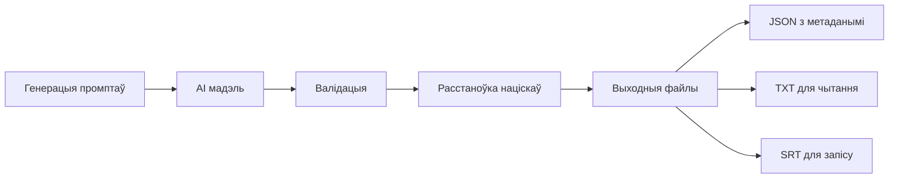
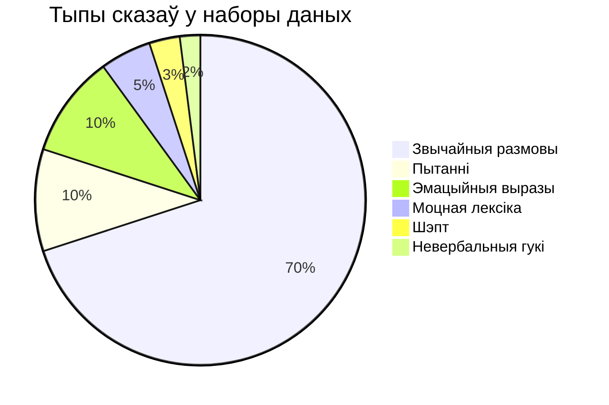
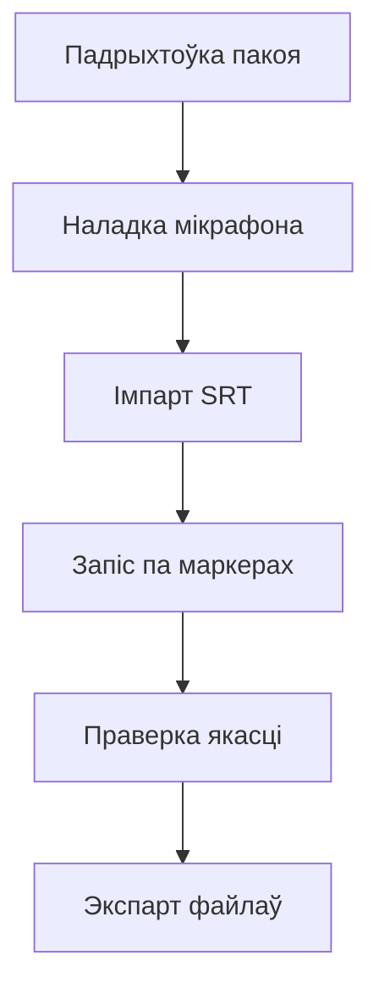

# Генератар беларускага набору даных для TTS

*Магутны інструмент для стварэння разнастайных беларускіх сказаў для навучання сінтэзу маўлення*

[Беларуская](#беларуская) | [English](#english)

---

<a name="беларуская"></a>
## Беларуская

⚠️ **CONTENT WARNING**: This dataset includes adult language, profanity, and strong emotional expressions for comprehensive TTS training.

A powerful tool that uses AI models (via Gemini CLI or OpenRouter API) to generate diverse Belarusian sentences for text-to-speech datasets, including normal speech, emotions, whispers, profanity, and non-verbal vocalizations.

## 🚀 Quick Start

```bash
# Install dependencies
bun install

# Option 1: Generate with Gemini CLI (requires GEMINI_API_KEY)
bun run generate

# Option 2: Generate with OpenRouter (requires OPENROUTER_API_KEY)
export OPENROUTER_API_KEY="your-key-here"
bun run generate:openrouter

# Validate and auto-fix
bun run validate:fix        # Uses Gemini CLI
bun run validate:openrouter # Uses OpenRouter

# Watch progress in real-time (in another terminal)
tail -f output/temp/session1_temp.txt
```

## 📋 Features

### Core Capabilities
- ✅ **Dual AI Provider Support**: Gemini CLI (1M context) or OpenRouter (50+ models)
- ✅ **22,500 sentences** across 25 recording sessions (~62.5 hours of material)
- ✅ **Intelligent Resume System**: Auto-saves every 100 sentences, never lose progress
- ✅ **Parallel Processing**: Up to 5x faster with concurrent batch generation
- ✅ **240,000+ Word Accent Database**: Context-aware stress marking for homographs

### Content Distribution
- **70% Normal conversation** - Natural Belarusian speech patterns
- **10% Questions** - Yes/no, what, where, when, why, how variations
- **10% Emotional expressions** - Joy, sadness, anger, fear, love, surprise
- **5% Strong language/profanity** - Authentic angry expressions (adult content)
- **3% Whispered speech** - Various quiet contexts and intensities
- **2% Non-verbal sounds** - Laughs, sighs, cries, coughs, yawns

### Language Quality Features
- ✅ **Anti-Russian Filter**: Detects and prevents Russian language influence
- ✅ **Gender Balance**: 40% feminine, 40% masculine, 20% neutral forms
- ✅ **Register Variety**: 70% colloquial, 20% neutral, 10% formal speech
- ✅ **Phonetic Optimization**: Tracks ў, дз, дж, ць for TTS training
- ✅ **Number Support**: Times, dates, prices, phone numbers, percentages
- ✅ **Abbreviation Handling**: г.д., сп., хв., універ. with pronunciation guides

### Technical Features
- ✅ **Real-time Progress Monitoring**: Live updates with ETA calculation
- ✅ **Professional SRT Generation**: Timed subtitles with 2-second gaps
- ✅ **Multi-format Output**: JSON (structured), TXT (readable), SRT (recording)
- ✅ **AI-Powered Validation**: Grammar, naturalness, and cultural appropriateness
- ✅ **Auto-fix Capability**: Backup → AI correction → Save workflow
- ✅ **Retry Logic**: Up to 5 retries with progressive delays for reliability

## 🛠️ Installation

1. **Install Bun** (JavaScript runtime):
```bash
curl -fsSL https://bun.sh/install | bash
```

2. **Choose your AI provider**:

   **Option A: Gemini CLI** (simpler setup):
   ```bash
   # Install Gemini CLI
   bun add -g @google/generative-ai-cli
   
   # Set up API key
   export GEMINI_API_KEY="your-api-key-here"
   ```

   **Option B: OpenRouter** (more models, pay-per-use):
   ```bash
   # Get API key from https://openrouter.ai/keys
   export OPENROUTER_API_KEY="your-key-here"
   ```

3. **Clone and install**:
```bash
git clone https://github.com/wiedymi/belarusian-tts-dataset.git
cd belarusian-tts-dataset
bun install

# Build the accent database (required, ~650MB)
bun run build:db
```

## 💻 Usage

### Generate Dataset

**Using Gemini CLI:**
```bash
# Standard generation (auto-save, resume, parallel)
bun run generate
```

**Using OpenRouter:**
```bash
# With default model (google/gemini-2.0-flash-exp:free)
bun run generate:openrouter

# With specific model
bun run generate:openrouter -m anthropic/claude-3.5-sonnet

# With custom sessions
bun run generate:openrouter -s 10 -p 2

# See all options
bun run generate:openrouter --help
```

**Clean and restart:**
```bash
bun run clean
bun run generate  # or generate:openrouter
```

### Monitor Progress

```bash
# Watch sentences being generated
tail -f output/temp/session1_temp.txt

# Check current count
wc -l output/temp/*.txt

# See overall progress
ls -la output/sentences/
```

### Validate Dataset

**Using Gemini CLI:**
```bash
# Basic validation (fast, regex-based)
bun run validate

# Deep validation with Gemini AI
bun run validate:deep

# Deep validation + auto-fix issues
bun run validate:fix
```

**Using OpenRouter:**
```bash
# Validate all sessions
bun run validate:openrouter

# Validate and fix issues
bun run validate:openrouter --fix

# Validate specific session
bun run validate:openrouter -s 1

# Use specific model for validation
bun run validate:openrouter -m openai/gpt-4o --fix
```

## 📁 Output Structure

```
output/
├── sentences/          # Final sentence files
│   ├── session1.json  # Structured data
│   ├── session1.txt   # Plain text
│   └── ...           
├── srt/               # Subtitle files for recording
│   ├── session1.srt   # Timed subtitles
│   └── ...           
├── reports/           # Generation statistics
│   └── generation_report.txt
└── temp/              # Auto-save files (during generation)
    ├── session1_temp.json
    └── session1_temp.txt
```

## ⚙️ Configuration

### Gemini CLI Configuration

Edit `src/generate-dataset.ts`:

```typescript
const CONFIG: GenerationConfig = {
  model: "gemini-2.5-pro",       // AI model (100 requests/day limit)
  sentencesPerSession: 900,      // Sentences per recording session (~2.5 hours)
  secondsPerSentence: 10,        // Time allocation per sentence in SRT
  batchSize: 300,               // Sentences per API call (3 calls per session)
  sessionCount: 25,              // Total sessions (25 × 900 = 22,500 sentences)
  parallelBatches: 1,           // Parallel processing (1 for Pro model due to rate limits)
};
```

Available models and their rate limits:
- `gemini-2.5-pro`: 100 requests/day (best quality, use 300 batch size)
- `gemini-2.5-flash`: Higher limits, good quality
- `gemini-2.0-flash-exp`: Free tier available

### OpenRouter Configuration

Command-line options:
```bash
-m, --model <model>              # Model to use
-s, --sessions <number>          # Number of sessions
--sentences-per-session <number> # Sentences per session
-p, --parallel-batches <number>  # Parallel batches
```

Available free models:
- `google/gemini-2.0-flash-exp:free` (recommended)
- `google/gemini-1.5-flash:free`
- `meta-llama/llama-3.2-1b-instruct:free`
- `mistralai/mistral-7b-instruct:free`

Paid models (better quality):
- `anthropic/claude-3.5-sonnet`
- `openai/gpt-4o`
- `google/gemini-pro`

### Configuration Guide

| Setting | Default | Description |
|---------|---------|-------------|
| `model` | varies | Gemini: gemini-2.5-pro, OpenRouter: google/gemini-2.0-flash-exp:free |
| `sentencesPerSession` | 900 | ~2.5 hours of recording per session |
| `secondsPerSentence` | 10 | Recording time window in SRT |
| `sessionCount` | 25 | Total sessions (900×25 = 22,500 sentences) |
| `parallelBatches` | 5 (Gemini), 3 (OpenRouter) | Concurrent API calls |

## 📊 What You Get

### Dataset Statistics
- **22,500 total sentences** across 25 recording sessions
- **62.5 hours** of recording material (at 10 seconds per sentence)
- **240,000+ word accent database** for stress marking
- **Professional recording support** with SRT timing files

### Content Breakdown (per 900-sentence session)
- **~630 normal conversation** (70%) - Everyday Belarusian speech
- **~90 questions** (10%) - Various interrogative forms
- **~90 emotional expressions** (10%) - 6 emotion types
- **~45 strong language** (5%) - Adult content with anger markers
- **~27 whispered speech** (3%) - Quiet/intimate contexts
- **~18 non-verbal sounds** (2%) - Natural vocalizations

### Language Features
- **Gender diversity**: Feminine (рабіла), masculine (рабіў), neutral forms
- **Speech registers**: Colloquial (70%), neutral (20%), formal (10%)
- **Phonetic coverage**: Balanced ў, дз, дж, ць distribution
- **Number handling**: Dates, times, prices, percentages included
- **Accent marking**: Context-aware stress placement (за́мак vs замо́к)

### Sample Output

```
[10001] Я люблю́ чыта́ць белару́скія кні́гі.
         → Normal conversational sentence with accent marks

[10002] (радасна) Я так шчаслі́вы сёння!
         → Emotional expression with joy marker

[10003] (шэпча) Ціха, дзіця́ спіць у суседнім пакоі.
         → Whispered speech for quiet context

[10004] (уздыхае)
         → Standalone non-verbal vocalization

[10005] (злосна) Ідзі́ ты к чо́рту са сваі́мі пара́дамі!
         → Strong language with anger marker
```

## 🎙️ Recording Guide

### Equipment Needed
- **Microphone**: USB condenser (Blue Yeti, AT2020) or XLR with interface
- **Environment**: Quiet room with minimal echo (use blankets/foam for acoustic treatment)
- **Software**: Reaper (free trial) or Audacity (free)
- **Headphones**: Closed-back for monitoring without bleed

### Pre-Recording Setup

1. **Room Preparation**:
   - Close windows and doors
   - Turn off fans, AC, refrigerators
   - Put phone on airplane mode
   - Hang blankets or use acoustic foam to reduce echo

2. **Microphone Setup**:
   - Position 6-8 inches from mouth
   - Use pop filter to reduce plosives
   - Set gain to peak around -12dB to -6dB
   - Test with loudest expected speech

3. **Recording Settings**:
   - Sample rate: 48kHz or 44.1kHz
   - Bit depth: 24-bit (16-bit minimum)
   - Format: WAV (lossless)
   - Mono recording (single channel)

### Recording Process

1. **Session Preparation**:
   - Review the session's SRT file first
   - Note the different sentence types
   - Warm up your voice (humming, tongue twisters)
   - Have water nearby (room temperature)

2. **Import SRT Markers**:
   - Reaper: View → Region/Marker Manager → Import
   - The SRT includes 2-second gaps between sentences
   - Each sentence has a unique ID [SESSION_NUMBER]

3. **Recording Technique**:
   - **Consistency is key**: Maintain same distance from mic
   - **Natural delivery**: Speak as if in real conversation
   - **Pacing**: Use the 2-second gaps to breathe and prepare
   - **Mistakes**: Re-record the sentence, we'll edit later

### Performance Guide by Type

**Normal Sentences (70%)**:
- Conversational tone, like talking to a friend
- Vary your intonation naturally
- Don't sound like reading - imagine the context
- Examples:
  - Statement: "Я іду ў краму па хлеб." (matter-of-fact)
  - Observation: "Сёння вельмі цёплае надвор'е." (pleasant)

**Questions (10%)**:
- Natural rising intonation at the end
- Express genuine curiosity or concern
- Vary between casual and serious questions
- Examples:
  - Casual: "Ты ўжо паабедаў?"
  - Concerned: "Што здарылася з табой?"

**Emotional Sentences (10%)**:
- **(радасна)** - Joy: Bright, energetic voice, smile while speaking
- **(сумна)** - Sadness: Lower energy, slower pace, softer tone
- **(злосна)** - Anger: Tense voice, faster pace, harder consonants
- **(са страхам)** - Fear: Trembling quality, higher pitch, breathiness
- **(з любоўю)** - Love: Warm, gentle, slightly breathy tone
- **(здзіўлена)** - Surprise: Higher pitch start, wide vocal range

**Whispered Sentences (3%)**:
- Move closer to mic (4-6 inches)
- Maintain articulation - whispers must be intelligible
- Types of whispers:
  - **(шэпча)** - Standard whisper
  - **(ціха)** - Very quiet but not full whisper
  - **(ледзь чутна)** - Barely audible, most intimate

**Non-verbal Sounds (2%)**:
- **(смяецца)** - Natural laughter, not forced
- **(уздыхае)** - Genuine sighs of various emotions
- **(плача)** - Crying sounds, from soft to sobbing
- **(кашляе)** - Natural coughs
- **(пазяхае)** - Authentic yawns
- Can be standalone or with speech after

**Profanity/Strong Language (5%)**:
- **(злосна)** - Angry delivery
- **(раздражнёна)** - Irritated, fed up
- **(лаецца)** - Swearing naturally
- Express real frustration, not theatrical
- Watch levels - anger shouldn't cause clipping

### Abbreviation Guide

When you see abbreviations, read them naturally:
- **г.** (год/гадзіна) - Read as "год" or "гадзіна" based on context
- **хв.** (хвіліна) - Read as "хвіліна" or "хвілін"
- **сп.** (спадар) - Read as "спадар"
- **спн.** (спадарыня) - Read as "спадарыня"
- **універ.** (універсітэт) - Read as "універсітэт"
- **г.д.** (і гэтак далей) - Read as "і гэтак далей"

### Quality Checklist

Before moving to next sentence:
- [ ] No background noise or room tone issues
- [ ] Consistent volume and distance
- [ ] Natural delivery (not robotic)
- [ ] Correct emotion/whisper/sound performed
- [ ] No clipping or distortion
- [ ] Clear pronunciation

### File Naming & Organization

```
audio/
├── session1/
│   ├── 1_10001.wav
│   ├── 1_10002.wav
│   └── ...
├── session2/
│   ├── 2_10001.wav
│   └── ...
```

### Post-Recording

1. **Quick Quality Check**:
   - Listen to a few random files
   - Check levels (should peak -6dB to -3dB)
   - Verify no clipping or distortion

2. **Batch Processing** (if needed):
   - Normalize to -3dB peak
   - Apply gentle noise reduction if necessary
   - NO heavy processing or compression

3. **Backup**:
   - Keep raw recordings
   - Create backup before any processing

### Common Issues & Solutions

**Too much echo**: Add more soft materials to room
**Plosives (p,b pops)**: Use pop filter, angle mic slightly
**Inconsistent volume**: Mark your position, use a mic stand
**Background noise**: Record during quiet hours, use noise gate
**Mouth sounds**: Stay hydrated, avoid dairy before recording

### Professional Tips

1. **Record in sessions**: Don't try to do 900 sentences at once
2. **Best time**: Morning after voice warm-up
3. **Take breaks**: Every 30-45 minutes
4. **Stay hydrated**: Room temperature water
5. **Consistent mood**: Record similar emotions together
6. **Review as you go**: Catch issues early

### Quick Setup Scripts

**Reaper Project Template**:
1. Save this as template after setup
2. Track 1: Recording (armed, monitoring on)
3. Master: Limiter at -0.5dB (safety)
4. Regions imported from SRT
5. Auto-naming set to $region

## 🏗️ Project Architecture

### Core Components

```
src/
├── generate-dataset.ts         # Main Gemini CLI generator
├── generate-dataset-openrouter.ts  # OpenRouter API generator
├── validate-dataset.ts         # Gemini validation coordinator
├── validate-dataset-openrouter.ts  # OpenRouter validation
├── types.ts                    # TypeScript interfaces
├── validator.ts                # Regex-based validation
├── gemini-validator.ts         # AI deep validation
├── prompts.ts                  # Prompt generation system
├── accent-utils-grammardb.ts   # Accent marking engine
├── grammardb-sqlite.ts         # 240K+ word database
└── cli-utils.ts                # Enhanced CLI interface
```

### Data Flow Pipeline

```
1. Prompt Generation
   ├─→ Topic rotation (8 themes)
   ├─→ Phonetic targets (ў, дз, дж, ць)
   └─→ Previous sentences (deduplication)

2. AI Generation (Parallel)
   ├─→ Gemini CLI or OpenRouter API
   ├─→ Batch processing (50-300 sentences)
   └─→ Retry logic (5 attempts)

3. Validation Pipeline
   ├─→ Regex validation (Russian detection)
   ├─→ Word count & structure checks
   └─→ Type classification

4. Accent Processing
   ├─→ GrammarDB lookup (240K+ words)
   ├─→ Context-aware stress placement
   └─→ Homograph disambiguation

5. Output Generation
   ├─→ JSON (full metadata)
   ├─→ TXT (human-readable)
   └─→ SRT (recording timing)
```

## 🔍 Features Explained

### Auto-Save & Resume System
- **Incremental saves**: Every 100 sentences to `output/temp/`
- **Session detection**: Checks `output/sentences/` for completed work
- **Deduplication**: Tracks last 5000 sentences to prevent repeats
- **Graceful recovery**: Continues from exact interruption point

### Parallel Processing Architecture
- **Adaptive parallelism**: 1-5 batches based on model rate limits
- **Load balancing**: Distributes work across available threads
- **Error isolation**: Failed batches don't affect others
- **Progress aggregation**: Real-time updates from all workers

### Real-Time Monitoring
```bash
# Terminal 1: Run generator
bun run generate

# Terminal 2: Watch live sentences
tail -f output/temp/session1_temp.txt

# Terminal 3: Monitor all sessions
watch -n 1 'ls -la output/sentences/'

# Terminal 4: Check specific content types
grep "(злосна)" output/temp/session1_temp.txt | tail
```

### Multi-Layer Validation System

**Layer 1: Regex Validation** (instant)
- Russian markers: ъ, щ, -ться, -ого/-его
- Belarusian features: ў, дз, дж, ць
- Word count: 3-20 words (type-specific)
- Character validation: No special symbols (except allowed)

**Layer 2: AI Deep Validation** (Gemini/OpenRouter)
- Grammar correctness with Belarusian rules
- Natural flow and readability
- Cultural appropriateness check
- Pronunciation difficulty assessment
- Context coherence validation
- Accent placement verification

**Layer 3: Auto-Fix Pipeline**
- Backup original to `output/backup/`
- AI-powered correction suggestions
- Validation loop until quality threshold
- Rollback capability on failure

## 🎯 Content Types & Distribution

### Sentence Types Generated

**Normal Sentences (70%)**:
- Standard conversational Belarusian
- 3-10 words optimal length
- Covers 8 rotating topics

**Emotional Sentences (10%)**:
- Joy: (радасна) expressions of happiness
- Anger: (злосна) frustrated statements  
- Sadness: (са слязамі) melancholic phrases
- Fear: (са страхам) anxious expressions
- Love: (з любоўю) affectionate words

**Profanity/Strong Language (8%)**:
- Mild: чорт, д'ябал, халера
- Medium: к чорту, заткніся
- Strong: на хрэн, explicit insults
- Includes angry emotional context

**Non-verbal Vocalizations (7%)**:
- Laughter: Ха-ха!, Хі-хі!
- Sighs: Ох..., Ах...
- Cries: Гу-гу-гу...
- Physical: Кхе-кхе!, Апчхі!
- Thinking: Хмм..., Э-э-э...

**Whispered Speech (5%)**:
- Marked with (шэпча), (ціха)
- Secrets, intimate expressions
- Cautious statements

### Topic Coverage

The generator cycles through 8 topics for vocabulary diversity:

1. Family, home, daily routines
2. Work, education, professions
3. Nature, weather, seasons
4. Culture, traditions, holidays
5. Sports, hobbies, entertainment
6. Travel, transportation, cities
7. Shopping, food, clothing
8. Health, emotions, wellbeing

## 📈 Performance & Rate Limits

### Generation Speed
| Model | Rate Limit | Batch Size | Time per Session | Daily Capacity |
|-------|------------|------------|------------------|----------------|
| gemini-2.5-pro | 100/day | 300 | ~5 minutes | 8-10 sessions |
| gemini-2.5-flash | 1000/day | 100 | ~15 minutes | Full dataset possible |
| OpenRouter (free) | Varies | 100 | ~10 minutes | Model dependent |

### Processing Performance
| Operation | Speed | Time for 900 sentences |
|-----------|-------|------------------------|
| Generation (Pro) | 3 API calls | ~5 minutes |
| Basic Validation | Instant | <1 second |
| Deep AI Validation | ~100/min | ~9 minutes |
| Auto-fix | ~30/min | ~30 minutes |
| Accent Marking | 1000/sec | <1 second |

## 🛠️ Troubleshooting

### "Gemini command not found"
```bash
# Reinstall Gemini CLI
bun add -g @google/generative-ai-cli
```

### API Errors
```bash
# Check API key
echo $GEMINI_API_KEY

# Test Gemini
gemini -p "Test"
```

### No files appearing
- Check `output/temp/` for in-progress files
- Ensure Gemini API is responding
- Check console for error messages

### Resume not working
- Don't delete `output/sentences/` files
- The generator checks these for existing progress

## 📝 Advanced Usage

### Custom Configuration

**Batch Size Optimization**:
```typescript
// For gemini-2.5-pro (100 requests/day limit)
batchSize: 300,  // 3 calls per session = 75 calls total

// For higher rate limit models
batchSize: 100,  // Better error handling, more granular progress
```

**Model Selection**:
```typescript
// Gemini CLI models
model: "gemini-2.5-pro",        // Best quality, 100/day limit
model: "gemini-2.5-flash",      // Good balance, higher limits
model: "gemini-2.0-flash-exp",  // Free tier, decent quality

// OpenRouter models (via CLI)
bun run generate:openrouter -m anthropic/claude-3.5-sonnet
bun run generate:openrouter -m openai/gpt-4o
bun run generate:openrouter -m google/gemini-pro
```

### Custom Topics & Prompts

Edit `src/prompts.ts` to customize:
```typescript
// Add custom topics to rotation
topicGuidances: [
  "TOPICS: Your custom theme here",
  // ...
]

// Adjust phonetic targets
phoneticTargets: {
  uwSounds: 20,    // More ў sounds
  dzhdz: 15,       // More дж/дз
  softSign: 10     // More soft signs
}
```

### Filtering Generated Content

```typescript
// Filter by sentence type
const familyFriendly = sentences.filter(s => 
  s.sentenceType !== 'profanity' &&
  s.emotionType !== 'злосна'
);

// Filter by word count
const shortSentences = sentences.filter(s => 
  s.wordCount >= 3 && s.wordCount <= 8
);

// Filter by phonetic features
const withBelarusianSounds = sentences.filter(s =>
  s.phonemeData.hasUSound || 
  s.phonemeData.hasDzSound
);
```

### Database Operations

```bash
# Rebuild accent database from scratch
bun run build:db

# Query accent database
sqlite3 data/grammardb.sqlite "SELECT * FROM words WHERE lemma LIKE 'замак%'"

# Export accented words
sqlite3 data/grammardb.sqlite ".mode csv" ".output accents.csv" "SELECT * FROM words"
```

## ⚠️ Content Filtering

If you need a family-friendly version:

```typescript
// Filter out adult content
const filtered = sentences.filter(s => 
  s.sentenceType === 'normal' || 
  s.sentenceType === 'whisper' ||
  (s.sentenceType === 'emotional' && s.emotionType !== 'anger')
);
```

The dataset includes `sentenceType` metadata for easy filtering.

## 🤝 Contributing

1. Fork the repository
2. Create your feature branch
3. Test thoroughly
4. Submit a pull request

## 📄 License

MIT License - see LICENSE file

## 🙏 Credits

- Uses Google's Gemini AI for generation
- Built with Bun runtime
- Inspired by the need for comprehensive Belarusian TTS datasets

---

**Happy generating! 🎉**

⚠️ Remember: This dataset contains adult content for realistic TTS training.

For issues or questions, please open a GitHub issue.

---

**ПАПЯРЭДЖАННЕ АБ ЗМЕСЦЕ**: Гэты набор даных уключае дарослую лексіку і моцныя эмацыйныя выразы для комплекснага навучання TTS.

### Агляд

Генератар выкарыстоўвае штучны інтэлект (Gemini або OpenRouter) для стварэння 22,500 унікальных беларускіх сказаў, прызначаных для навучання сістэм тэкст-у-маўленне. Набор даных уключае звычайнае маўленне, эмоцыі, шэпт і невербальныя гукі.

### Хуткі старт

```bash
# Усталюйце залежнасці
bun install

# Пабудуйце базу дадзеных націскаў
bun run build:db

# Варыянт 1: Генерацыя праз Gemini CLI
bun run generate

# Варыянт 2: Генерацыя праз OpenRouter
export OPENROUTER_API_KEY="ваш-ключ"
bun run generate:openrouter

# Праверка і выпраўленне
bun run validate:fix
```

### Асноўныя магчымасці

#### Архітэктура апрацоўкі



#### Размеркаванне кантэнту



#### Ключавыя асаблівасці

| Магчымасць | Апісанне |
|------------|----------|
| **22,500 сказаў** | 25 сесій па 900 сказаў (62.5 гадзін матэрыялу) |
| **Падтрымка двух AI** | Gemini CLI (1M кантэкст) або OpenRouter (50+ мадэляў) |
| **240,000+ слоў з націскамі** | База дадзеных GrammarDB для кантэкстнай расстаноўкі націскаў |
| **Аўтазахаванне** | Захаванне кожныя 100 сказаў з магчымасцю аднаўлення |
| **Паралельная апрацоўка** | Да 5 адначасовых пакетаў для хуткасці |
| **Анты-рускі фільтр** | Выяўленне і прадухіленне русізмаў |
| **Фанетычная аптымізацыя** | Адсочванне ў, дз, дж, ць для TTS |

### Усталёўка

1. **Усталюйце Bun** (JavaScript рантайм):
```bash
curl -fsSL https://bun.sh/install | bash
```

2. **Абярыце AI правайдэра**:

   **Варыянт А: Gemini CLI** (прасцейшая наладка):
   ```bash
   # Усталюйце Gemini CLI
   bun add -g @google/generative-ai-cli
   
   # Наладзьце API ключ
   export GEMINI_API_KEY="ваш-api-ключ"
   ```

   **Варыянт Б: OpenRouter** (больш мадэляў):
   ```bash
   # Атрымайце API ключ з https://openrouter.ai/keys
   export OPENROUTER_API_KEY="ваш-ключ"
   ```

3. **Кланіруйце і ўсталюйце**:
```bash
git clone https://github.com/wiedymi/belarusian-tts-dataset.git
cd belarusian-tts-dataset
bun install

# Пабудуйце базу націскаў (патрабуецца, ~650MB)
bun run build:db
```

### Што вы атрымаеце

#### Статыстыка набору даных

| Паказчык | Значэнне |
|----------|----------|
| **Агульная колькасць сказаў** | 22,500 |
| **Колькасць сесій** | 25 |
| **Сказаў на сесію** | 900 |
| **Час запісу на сесію** | ~2.5 гадзіны |
| **Агульны час запісу** | 62.5 гадзін |
| **База слоў з націскамі** | 240,000+ |

#### Разбіўка па тыпах (на сесію)

| Тып кантэнту | Колькасць | Працэнт |
|--------------|-----------|----------|
| Звычайныя размовы | ~630 | 70% |
| Пытанні | ~90 | 10% |
| Эмацыйныя выразы | ~90 | 10% |
| Моцная лексіка | ~45 | 5% |
| Шэпт | ~27 | 3% |
| Невербальныя гукі | ~18 | 2% |

### Карыстанне

#### Генерацыя набору даных

**Праз Gemini CLI:**
```bash
bun run generate
```

**Праз OpenRouter:**
```bash
# З бясплатнай мадэллю
bun run generate:openrouter

# З канкрэтнай мадэллю
bun run generate:openrouter -m anthropic/claude-3.5-sonnet

# З карыстальніцкімі параметрамі
bun run generate:openrouter -s 10 -p 2
```

#### Маніторынг прагрэсу

```bash
# Глядзіце генераваныя сказы
tail -f output/temp/session1_temp.txt

# Праверце бягучую колькасць
wc -l output/temp/*.txt

# Гляньце агульны прагрэс
ls -la output/sentences/
```

#### Валідацыя і выпраўленне

```bash
# Базавая валідацыя (хуткая, regex)
bun run validate

# Глыбокая валідацыя з AI
bun run validate:deep

# Валідацыя + аўтавыпраўленне
bun run validate:fix
```

### Кіраўніцтва па запісе

#### Неабходнае абсталяванне

| Тып | Рэкамендацыі |
|-----|-------------|
| **Мікрафон** | USB кандэнсатар (Blue Yeti, AT2020) або XLR з інтэрфейсам |
| **Асяроддзе** | Ціхі пакой з мінімальным рэха |
| **Праграмнае забеспячэнне** | Reaper (бясплатны пробны перыяд) або Audacity |
| **Навушнікі** | Закрытыя для маніторынгу без уцечкі |

#### Працэс запісу



#### Выкананне па тыпах

| Тып | Маркер | Як выконваць |
|-----|--------|-------------|
| **Звычайны** | - | Натуральны размоўны тон |
| **Радасць** | (радасна) | Яркі, энергічны голас |
| **Смутак** | (сумна) | Ніжэйшая энергія, павольны тэмп |
| **Гнеў** | (злосна) | Напружаны голас, хуткі тэмп |
| **Страх** | (са страхам) | Дрыжачы голас, вышэйшы тон |
| **Шэпт** | (шэпча) | Бліжэй да мікрафона, ціха |
| **Невербальны** | (смяецца) | Натуральныя гукі |

### Структура выходных файлаў

```
output/
├── sentences/          # Фінальныя файлы сказаў
│   ├── session1.json   # Структураваныя даныя
│   ├── session1.txt    # Просты тэкст
│   └── ...           
├── srt/                # Файлы субцітраў для запісу
│   ├── session1.srt    # Часавыя маркеры
│   └── ...           
├── reports/            # Статыстыка генерацыі
│   └── generation_report.txt
└── temp/               # Файлы аўтазахавання
    ├── session1_temp.json
    └── session1_temp.txt
```

### Прыклады выхаду

```
[10001] Я люблю́ чыта́ць белару́скія кні́гі.
         → Звычайны размоўны сказ з націскамі

[10002] (радасна) Я так шчаслі́вы сёння!
         → Эмацыйны выраз з маркерам радасці

[10003] (шэпча) Ціха, дзіця́ спіць у суседнім пакоі.
         → Шэптанае маўленне для ціхага кантэксту

[10004] (уздыхае)
         → Асобны невербальны гук

[10005] (злосна) Ідзі́ ты к чо́рту са сваі́мі пара́дамі!
         → Моцная лексіка з маркерам гневу
```

### Фільтрацыя кантэнту

Калі вам патрэбна версія для сям'і:

```typescript
// Фільтраваць дарослы кантэнт
const filtered = sentences.filter(s => 
  s.sentenceType === 'normal' || 
  s.sentenceType === 'whisper' ||
  (s.sentenceType === 'emotional' && s.emotionType !== 'anger')
);
```

### Ліцэнзія

MIT License - глядзіце файл LICENSE

### Крэдыты

- Выкарыстоўвае Google Gemini AI для генерацыі
- Пабудавана з Bun runtime
- GrammarDB для расстаноўкі націскаў

---

<a name="english"></a>
## English